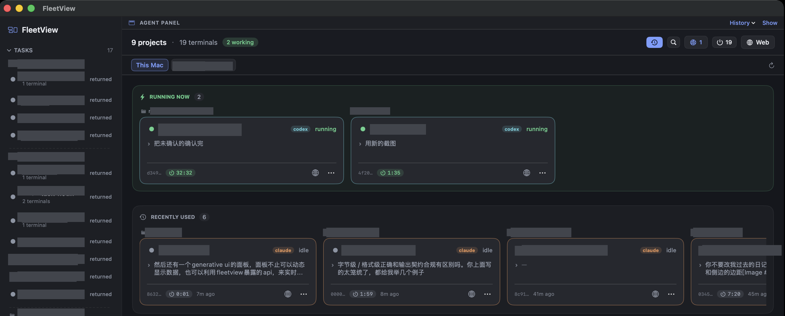
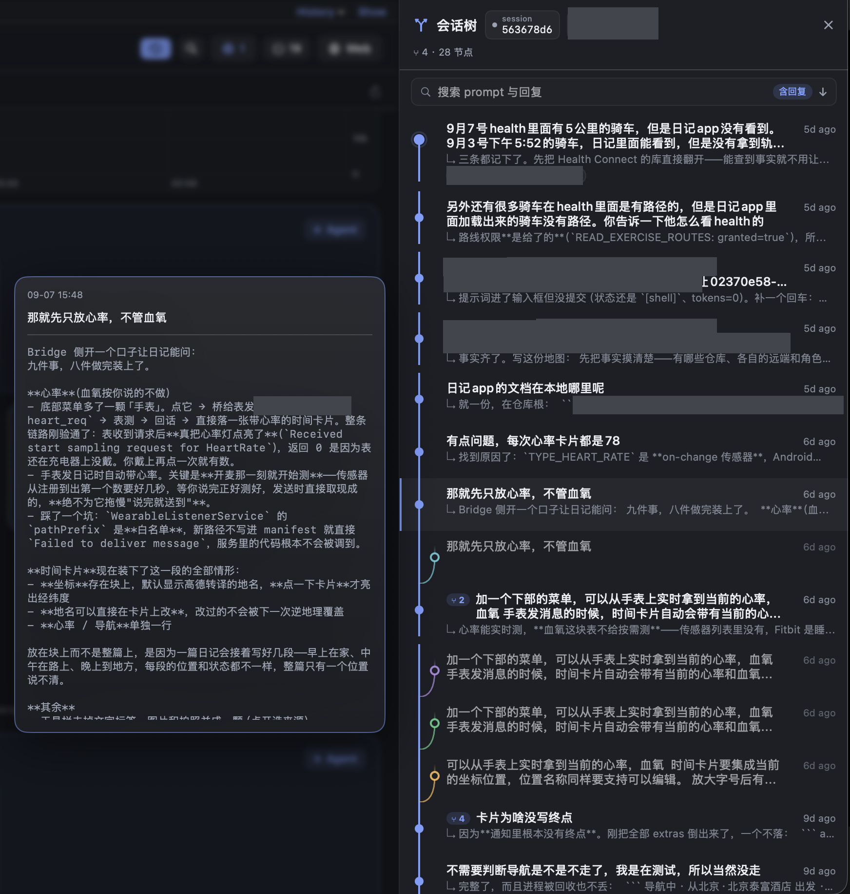
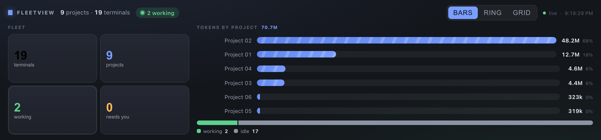
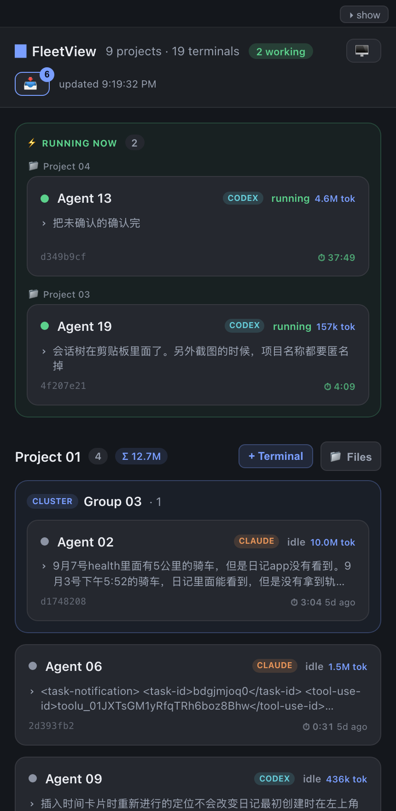
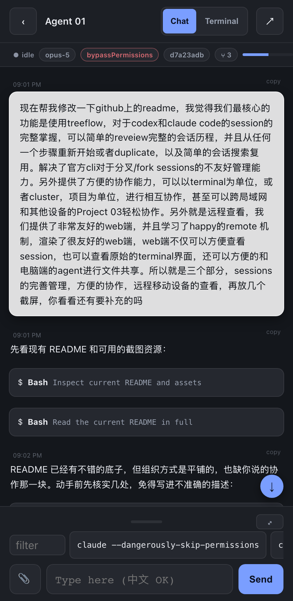

# FleetView

[English](README.md) · [简体中文](README.zh-CN.md)

在 macOS 上管理 Claude Code 和 Codex 终端。

FleetView 把多个 agent 会话放在同一个看板上，按项目分组。哪个还在运行、哪个在等你回复、上次交给它什么任务，
都能直接看到。你也可以查看和恢复对话分支，让 agent 生成自定义的 Generative UI 面板，或在手机上继续操作。



*配图中的项目名、终端名和路径已匿名化。*

## 对话历史与分支

会话树展示 Claude Code 和 Codex 对话中的 prompt 和分支，包括之前没有继续的分支。
选中一个节点可以阅读历史，也可以在新终端中从那里接着聊。正在运行的会话同样可以复制一份，保留上下文，尝试另一个方向。



从历史节点继续时，FleetView 会优先恢复已有会话；如果需要新建分支，就生成一份包含该节点之前历史的会话文件，
原始记录保持不变。Claude 的实现内置在应用中，移植自
[treeflow](https://github.com/nitpicker55555/Agent-Treeflow) 的分支算法；从 Codex 历史节点继续则需要安装 treeflow。

按 **⌘K** 搜索本机的 Claude Code 和 Codex 对话记录，按 **Tab** 在看板终端、当前对话和全部历史之间切换搜索范围。
把搜索结果拖到看板上，就能从对应位置继续对话。

搜索索引会保留已收录的对话内容。即使原始记录后来被删除，仍然可以搜索、阅读，并重建成可继续使用的会话。

## 终端管理与协作

每个终端对应一张卡片，显示状态、最后一条 prompt、token 消耗和运行时长。卡片按项目分组；
把一张卡片拖到另一张上，可以将相关终端归为一个 cluster。卡片也可以连同对话一起移到其他项目。

附带的 `project-manager` 命令行工具通过 FleetView 的 HTTP API 列出终端、读取输出、发送输入。
agent 可以用它查看另一个 agent 的进度、回应权限询问，或交给它下一项任务。
仓库的 `.claude/skills/` 中提供了相关 skill。

```bash
project-manager ls                 # 列出终端、状态、token 和最后的 prompt
project-manager ls -p FleetView    # 按项目筛选
project-manager show <sel> -l 60   # 查看终端最近的输出
project-manager send <sel> "继续"   # 发送指令
project-manager whoami             # 查看当前所在的终端
project-manager check              # 找出以报错结束的会话
```

这些命令也能连接另一台 Mac 上的 FleetView。用 `project-manager peers` 发现网络中的实例，
再通过 `-u <url>` 指定要连接的地址。

## Generative UI 面板

agent 可以根据当前任务生成一个面板，用来展示进度、图表、测试结果，或汇总多个 agent 的运行情况。
将自包含的 HTML 页面写入 `~/.fleetview/ui/panel.html` 后，它就会出现在桌面看板和手机仪表盘的顶部，
修改页面后会自动刷新。

面板支持动态更新数据，也可以直接调用 FleetView 暴露的 API，实时拉取 agent 的活跃数据：

- **展示任务数据：** agent 将进度或结果写入 `~/.fleetview/ui/panel.json`，面板通过 `GET /panel-data`
  定时读取，更新页面中的对应内容。
- **查看 agent 活动：** 面板通过 `GET /state` 获取各终端的当前状态、最后一条 prompt、token 消耗、
  距上次活跃的时间和运行时长。可以据此统计有多少 agent 正在工作、空闲或等待回复，也可以按项目汇总。

面板由 FleetView 自身的 Web 服务提供，页面中的 JavaScript 可以直接使用 `fetch('/state')` 或
`fetch('/panel-data')`。仓库里的[示例面板](examples/fleet-panel.html) 每 1.5 秒拉取一次 `/state`，
刷新状态统计和 token 图表，可以在它的基础上修改。

每个 FleetView 实例共用一个面板。写入新的 `panel.html` 会替换当前页面，删除文件则会隐藏面板。



*示例面板通过 `/state` 读取当前 FleetView 的实时数据。*

## 手机访问

FleetView 在 Mac 上提供 Web 仪表盘，通过局域网或 Tailscale 就能访问，无需账号，也不用单独部署服务。

对话以聊天形式显示，方便在手机上阅读 agent 的执行过程、回应权限询问和发送新消息。
需要操作 CLI 选择器、查看 diff 或直接输入时，也可以打开实时终端界面。

文件支持双向传递：从手机上传照片或文件作为 prompt 的附件；在 Mac 上运行 `fleetview-send report.pdf`，
则会把文件放入仪表盘的文件托盘，方便在手机上查看 agent 生成的报告或其他产物。

<p>
  
  
</p>

*Web 仪表盘与一段对话，使用手机尺寸的浏览器窗口截图。*

## 环境要求

- macOS 14+
- Claude Code 和／或 Codex CLI
- 远程终端访问需要 `tmux` 和 `ttyd`（`brew install tmux ttyd`）；未安装时仍可使用本地终端。
- 从 Codex 历史节点继续对话需要 [treeflow](https://github.com/nitpicker55555/Agent-Treeflow)。
  构建脚本会询问是否安装，Claude 的相关支持已内置。

## 安装

从 [Releases](../../releases) 下载 `FleetView.app`，或从源码构建：

```bash
git clone https://github.com/nitpicker55555/FleetView.git
cd FleetView
./scripts/package_app.sh --install  # 构建并复制到 /Applications
```

## 本地数据与会话

FleetView 将应用状态、搜索索引、日志、传输的文件和自定义面板保存在 `~/.fleetview/`。
对话历史从 `~/.claude/projects/` 和 `~/.codex/sessions/` 读取；创建分支时会生成独立会话，不修改原始记录。

默认情况下，退出 FleetView 后 tmux 会话会继续运行，下次启动时重新连接。关闭终端会停止其中运行的会话。
如果希望退出应用时一并关闭所有终端，可以在设置中开启该选项。

FleetView 会为 Claude Code 和 Codex 安装状态 hook，可以通过
**FleetView → Uninstall Status Hooks** 移除。

## 网络访问

仪表盘和 API 监听所有网卡，使用未加密、无身份认证的 HTTP。能访问该端口的设备就能读取对话并向终端发送输入。
请在可信网络或 Tailscale 中使用，避免将端口暴露到公共网络。通过 `project-manager` 访问时也一样。

FleetView 最多每六小时检查一次 GitHub Releases。可以在 `~/.fleetview/logging.json` 中设置
`"updates": false` 来关闭更新检查。
